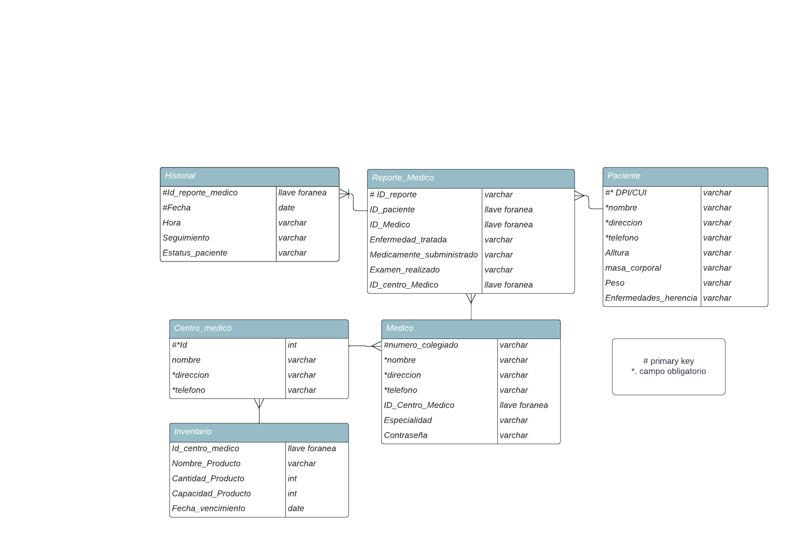

# MediCom
**Proyecto 2 --base de datos 1--**

El proyecto contempla el uso de tecnología de Base de Datos para la modelación y creación de
una base de datos para un sistema de aplicación, con el objetivo de interactuar con la base de
datos desde un lenguaje de programación libre a fin de implementar un sistema complejo y
robusto con un fuerte modelo de datos soportado por una base de datos normalizada.

-----------------------------------------------------------------------------------------------

# API

https://github.com/Jskenpo/MediComAPI.git

-----------------------------------------------------------------------------------------------

